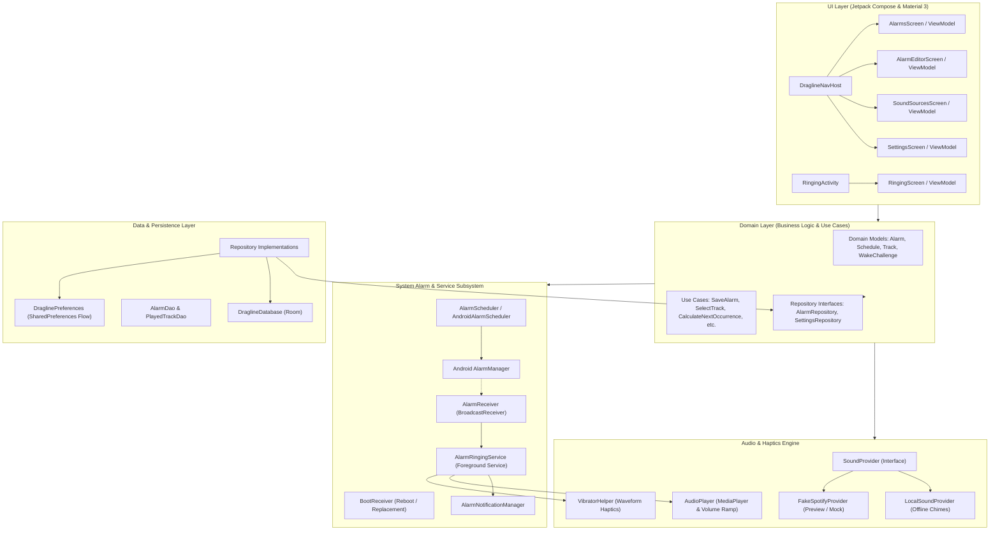
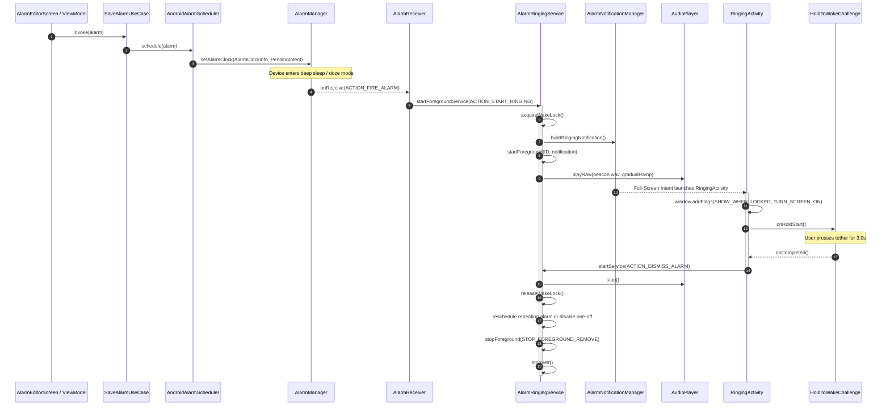

# Dragline Architecture & Technical Design

This document details the architectural design, layer boundaries, data flow, and subsystem mechanics of **Dragline**, an open-source smart alarm application for Android.

---

## 1. Architectural Principles

1. **Reliability as Invariant**: An alarm must sound under all circumstances—network loss, service downtime, low-memory pressure, or battery optimization. The offline fallback path is non-negotiable.
2. **Pragmatic Layered Architecture**: Clear separation of concerns across UI, Domain, Data, Scheduling, Audio, and Challenge subsystems without module fragmentation at the skeleton phase.
3. **Unidirectional Data Flow (UDF)**: UI state is modeled as immutable data classes emitted via Kotlin `StateFlow` from ViewModels and consumed reactively by Jetpack Compose.
4. **No-Snooze Enforcement**: The dismissal path requires deliberate user engagement through a `WakeChallenge`. Standard snooze actions are intentionally omitted.
5. **Contextual Extensibility**: Scheduling is modeled beyond fixed time (e.g., sunrise and meeting-relative alarms) through extensible interfaces with zero premature permission leaks.

---

## 2. High-Level Architecture Overview



---

## 3. Subsystem Breakdown

### 3.1. Domain Layer (`domain/`)
The core domain model is completely independent of Android framework dependencies (except standard Java time APIs `java.time.*`).

- **`domain.model.Alarm`**: Core entity representing a configured alarm.
  ```kotlin
  data class Alarm(
      val id: Long = 0L,
      val label: String = "Alarm",
      val isEnabled: Boolean = true,
      val schedule: Schedule = Schedule.FixedTime(LocalTime.of(7, 0)),
      val soundSource: SoundSource = SoundSource.LocalSound(),
      val localFallbackSound: String = "beacon",
      val wakeChallengeType: WakeChallengeType = WakeChallengeType.HOLD_TO_WAKE,
      val isVibrationEnabled: Boolean = true,
      val isGradualVolumeEnabled: Boolean = true,
      val nextTriggerEpochMs: Long = 0L
  )
  ```
- **`domain.model.Schedule`**: Sealed hierarchy representing scheduling strategies:
  - `FixedTime(time: LocalTime, repeatDays: Set<DayOfWeek>)`: Exact clock time with optional weekday repetition.
  - `Sunrise(offsetMinutes: Int, repeatDays: Set<DayOfWeek>)`: Solar-relative scheduling.
  - `FirstMeeting(offsetMinutes: Int, repeatDays: Set<DayOfWeek>)`: Calendar-relative scheduling.
- **`domain.usecase.SelectTrackUseCase`**: Deterministic smart track selection algorithm:
  1. Filters playlist tracks against recent history (tracks played within `recentSongExclusionDays`).
  2. If unplayed tracks exist, selects one deterministically or randomly.
  3. If all tracks in the collection have been played within the window, falls back to the **least-recently played** track according to timestamps.
  4. Never returns null unless the collection itself is empty.
- **`domain.usecase.CalculateNextOccurrenceUseCase`**: Dispatches next-trigger calculations to appropriate calculators (`FixedTimeCalculator`, `SunriseScheduleCalculator`, etc.).

---

### 3.2. Alarm Scheduling & Ringing Lifecycle (`alarm/`)

Dragline manages exact alarm execution across device standby states and system reboots.

#### Lifecycle Sequence:


#### Reliability Guarantees:
- **`AlarmManager.setAlarmClock`**: Guarantees delivery even in Android Doze mode and displays the upcoming alarm on the system status bar and lock screen.
- **WakeLock Management**: `AlarmReceiver` and `AlarmRingingService` acquire partial wake locks with 10-minute safety timeouts to keep the CPU awake during audio playback and user challenge completion.
- **`BootReceiver`**: Automatically queries `AlarmRepository` upon `ACTION_BOOT_COMPLETED` and `ACTION_MY_PACKAGE_REPLACED`, recalculates upcoming timestamps, and registers them with `AlarmManager`.

---

### 3.3. Sound Provider Architecture (`audio/`)

Audio sources implement the provider-neutral `SoundProvider` contract:

```kotlin
interface SoundProvider {
    val id: String
    val displayName: String
    val connectionState: ProviderConnectionState

    suspend fun authenticate(): Result<Unit>
    suspend fun listCollections(): List<SoundCollection>
    suspend fun getTracks(collectionId: String): List<Track>
    suspend fun playTrack(track: Track): PlaybackResult
    suspend fun stopPlayback()
}
```

- **`LocalSoundProvider`**: Directly plays bundled 16-bit PCM multi-tone WAV audio (`res/raw/beacon.wav` and `res/raw/resonance.wav`) via `MediaPlayer` with `AudioAttributes.USAGE_ALARM`.
- **`FakeSpotifyProvider`**: Emulates realistic Spotify playlists ("Morning Indie Acoustic", "Electric Sunrise", "Ambient Horizon") and track metadata. Its playback execution deliberately fails with `canFallback = true`, triggering `AlarmRingingService`'s fallback path to test reliability.
- **`AudioPlayer`**: Controls volume ramping from 5% to 100% over the user-configured duration (e.g. 30s, 60s, 120s) via periodic non-blocking coroutines.

---

### 3.4. Wake Challenge Architecture (`challenge/`)

Dismissal requires physical or cognitive effort to ensure wakefulness.

- **`WakeChallenge`**: Base abstraction defining challenge metadata and execution contracts.
- **`HoldToWakeChallenge`**:
  - Requires continuous touch contact on the tether button for 3000 ms.
  - If the touch is released before completion, progress smoothly resets to 0%.
  - Emits real-time progress (`0.0f` to `1.0f`) to power the circular Canvas arc animation.
  - Fires tactile confirmation (`VibratorHelper.vibrateShortTick()`) upon successful completion.
- **Coming Soon Extension Points**:
  - `NfcChallenge`: Verification via physical NFC tag serial or NDEF message.
  - `QrChallenge`: Verification via camera scanning against an expected payload hash.
  - `StepCountChallenge`: Verification via Android step counter sensor.

---

### 3.5. Persistence Layer (`data/`)

- **Room Database (`DraglineDatabase`)**:
  - **`alarms` table**: Stores alarm configuration, schedule type, time, repeat days (serialized as comma-separated enum names), sound source, and fallback selection.
  - **`played_tracks` table**: Logs timestamps of played tracks to inform `SelectTrackUseCase`'s anti-repetition filter.
- **Data Conversion (`AlarmMapper`)**: Pure transformation functions converting between Room `AlarmEntity` and domain `Alarm` models.
- **Settings Store (`DraglinePreferences`)**: Implements `SettingsRepository` using private `SharedPreferences` with reactive `callbackFlow` emitting `UserSettings` on change.

---

### 3.6. Presentation Layer (`ui/`)

- **Jetpack Compose & Material 3**:
  - Reactive, state-driven UI consuming `StateFlow` from Hilt ViewModels.
  - No business logic in composables.
  - Custom brand aesthetics: Deep Slate background (`#0D0F12`), Electric Amber (`#F59E0B`), and Cyan (`#06B6D4`) tether lines.
- **Navigation Compose**:
  - Bottom navigation between top-level destinations: `alarms`, `sources`, and `settings`.
  - Nested destination for `editor?alarmId={alarmId}` with backstack preservation.
- **Accessibility & Contrast**:
  - All interactive elements meet 48dp touch target requirements.
  - High-contrast text conforming to WCAG 2.1 AA standards.
  - Explicit semantic descriptions for screen readers.

---

## 4. Permission Model & Android Security

| Permission | API Level | Purpose | Graceful Degradation Strategy |
| :--- | :--- | :--- | :--- |
| `SCHEDULE_EXACT_ALARM` | 31+ | Exact second alarm scheduling | If denied, falls back to `setAndAllowWhileIdle` and renders an in-app permission card. |
| `USE_EXACT_ALARM` | 33+ | System-level exact alarm permission for clock/alarm apps | Declared for Google Play Alarm Clock category exemption. |
| `POST_NOTIFICATIONS` | 33+ | High-priority ringing notifications | If denied, ringing audio still plays in foreground service; in-app card informs user. |
| `USE_FULL_SCREEN_INTENT` | 29+ | Displaying `RingingActivity` over lock screen | Notification fallback displayed if full-screen presentation is restricted. |
| `WAKE_LOCK` | 1+ | Preventing device sleep while alarm sounds | Safety timeout of 10 minutes releases wake lock automatically if unhandled. |
| `RECEIVE_BOOT_COMPLETED` | 1+ | Restoring active alarms upon device restart | None; automatic background broadcast execution. |
| `FOREGROUND_SERVICE_MEDIA_PLAYBACK` | 34+ | Foreground service audio playback execution | Declared on `AlarmRingingService`. |

---

## 5. Developer Extension Guides

### Adding a New Sound Provider
1. Create a class implementing `audio.SoundProvider`.
2. Implement `listCollections()`, `getTracks()`, and `playTrack()`.
3. Provide the class in `di.AudioModule.provideSoundProviders()`.
4. Update `AlarmEditorScreen` and `SoundSourcesScreen` to display the new provider.

### Adding a New Wake Challenge
1. Create a class implementing `challenge.WakeChallenge`.
2. Add a new entry to `domain.model.WakeChallengeType`.
3. Create the corresponding challenge Compose UI in `ui/ringing/components/`.
4. Wire the challenge progress into `RingingViewModel`.

### Adding a Contextual Schedule Calculator
1. Implement `scheduling.ScheduleCalculator<Schedule.YourScheduleType>`.
2. Provide the calculator in `di.SchedulingModule`.
3. Inject and dispatch in `domain.usecase.CalculateNextOccurrenceUseCase`.
